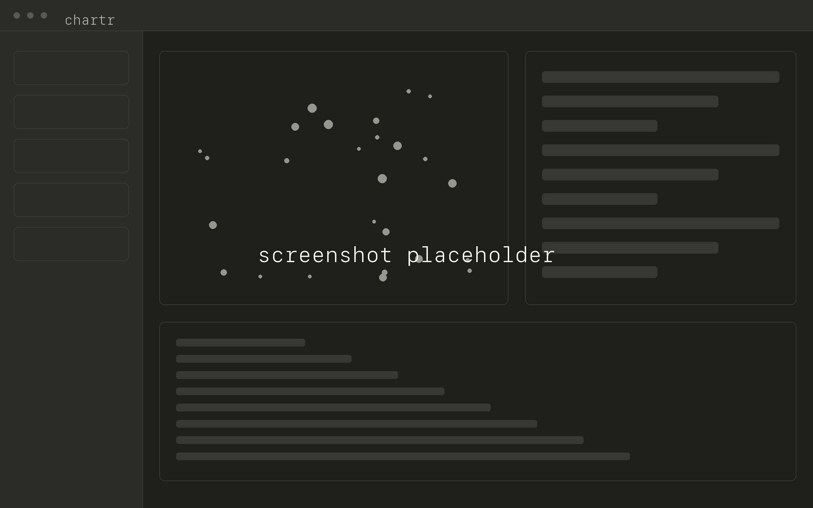

# chartr


**Agent multiplexer with a map of the work.**

[Download macOS app](https://github.com/rengwu/chartr/releases/latest)

Chart a wayfinder map inside chartr, then drive it to completion. The plan
renders as a star-map; take a ticket off the frontier, pick an agent, and the
session opens with the map, the ticket, and its blockers' answers already in the
buffer.

Without a map it is a plain multiplexer: repos in a sidebar, shells and agent
CLIs in tabs.

<br clear="right">



## Key features

- **Chart the map without leaving.** Launch a planning agent from the sidebar and
  whatever it writes to `.plan/maps/` draws as a star-map the moment it hits disk.
- **Spawn off the frontier.** Take an unblocked ticket, pick a role and an agent,
  and the session opens in that agent's own TUI with full context already
  submitted.
- **Whatever CLI you run.** The adapter models one thing, how a binary takes its
  opening line, so anything on `PATH` registers and claude, codex, opencode,
  kimi, grok and pi are detected for you.
- **Tells blocked from thinking.** Tab status comes from what an agent broadcasts
  and draws, so the sidebar flags whichever space is waiting on you.
- **The map on disk is the state.** A ticket resolves when its `## Answer`
  appears, and chartr's only writes are the claim and release commits on the
  ticket file.
- **Skills are files.** Plain `SKILL.md` directories you can shadow per repo or
  per machine, and your own launchable skill shows up in the sidebar.
- **Terminal in one TOML.** Presets, 21 colour slots, font, cursor, padding,
  keybindings.

## Installation

GitHub releases only — no `go install`, no Homebrew tap, no marketplace entry.
Grab your platform's archive from the
[releases page](https://github.com/rengwu/chartr/releases), check it against
`checksums.txt`, run it:

```
chartr                 # http://127.0.0.1:8787
chartr -addr :9000
chartr -data-dir ~/w   # session root (default: cwd)
chartr -version
```

User config lives under `~/.config/chartr`. Agent CLIs are yours to install;
chartr ships none, and the empty agent library refuses every spawn until you
register one.

### macOS first launch

The `.dmg` is unsigned and not notarized — no Apple Developer account here — so
macOS blocks the first launch. Verified on macOS 27:

1. Open chartr. On **"chartr" Not Opened**, click **Done** — _not_ **Move to Trash**, the highlighted button.
2. **System Settings → Privacy & Security → Security** → **Open Anyway**, authenticate, **Open Anyway** again.

Every later launch opens clean. Right-click → Open no longer works for this,
whatever older advice says. Or:
`xattr -d com.apple.quarantine /Applications/chartr.app`.

Bounces with no window? Run
`/Applications/chartr.app/Contents/MacOS/chartr` for the error Finder swallows.

### From source

Go 1.26+, Node 22+.

```
make build     # web/dist, then bin/chartr
make check     # go vet + svelte-check
make test
make dmg       # the macOS app (macOS only)
```

## Documentation

- [CONTEXT.md](CONTEXT.md) — the glossary. Space, map, ticket, frontier, session,
  role, agent, adapter, context bundle: what each word means here and what it
  deliberately isn't.
- [docs/adr/](docs/adr/) — sixteen decision records, amendments included. Why the
  adapters are agent-agnostic ([0002](docs/adr/0002-agent-agnostic-adapters.md)),
  why there are no worktrees ([0003](docs/adr/0003-serialise-per-space-no-worktrees.md)),
  why state is derived ([0004](docs/adr/0004-derived-ticket-state-and-proposed-answer.md)),
  why nothing accumulates ([0005](docs/adr/0005-assembled-context-no-agent-memory.md)),
  and where the human gate went ([0015](docs/adr/0015-map-kind-removed-role-comes-from-the-ticket.md)).
- [skills/README.md](skills/README.md) — the shipped skill library and how the
  three layers resolve.
- [docs/skill-sync.md](docs/skill-sync.md) — re-fitting upstream skill changes
  onto the vendored copies.
- [docs/design-system.md](docs/design-system.md) — read before touching the UI.

## Project status

**Pre-release.** Nothing is tagged, so the releases page is empty until the first
cut — build from source for now. chartr is used to build chartr, but the shape
still moves and breaking changes are expected before 1.0.

Blockers for `v0.1.0`:

- [x] Spaces, tabs, activity detection
- [x] Maps: star-map, spawn, claim/release
- [x] Release pipeline — checksummed binaries, best-effort shells, macOS `.dmg`
- [ ] Tag it
- [ ] Getting started, written against a fresh machine

Not planned: a hosted service, an account, anything that phones home.

## Platform support

One **supported** artifact: the cgo-free binary that serves the cockpit in your
browser, green on all three OSes before a tag ships. The native webview shells
need cgo and system webview libs, build in a non-blocking CI lane, and attach only
where their toolchains succeeded ([ADR 0011](docs/adr/0011-one-supported-artifact-tiered-extras.md)).

| Platform                  | Binary | Desktop app                                     |
| ------------------------- | ------ | ----------------------------------------------- |
| macOS `arm64`             | ✅     | `.dmg` + shell, [unsigned](#macos-first-launch) |
| macOS `amd64`             | ✅     | — (cgo won't cross-compile)                     |
| Linux `amd64` / `arm64`   | ✅     | shell, needs WebKitGTK                          |
| Windows `amd64` / `arm64` | ✅     | shell via `go-webview2`                         |

Windows is built and its ConPTY layer is smoke-tested every change, but it isn't
driven daily — **WSL2 is the sure path**. Build a shell yourself with `make webview`
([ADR 0013](docs/adr/0013-webview-shell-architecture.md)).

## Related projects

- [herdr](https://github.com/ogulcancelik/herdr) — the agent multiplexer that inspired this, in your terminal instead of a window
- [wayfinder-maps](https://github.com/rengwu/wayfinder-maps) — my read-only map CLI and viewer; where the star-map started
- [mattpocock/skills](https://github.com/mattpocock/skills) — the original `/wayfinder` skill and the method the maps side drives
