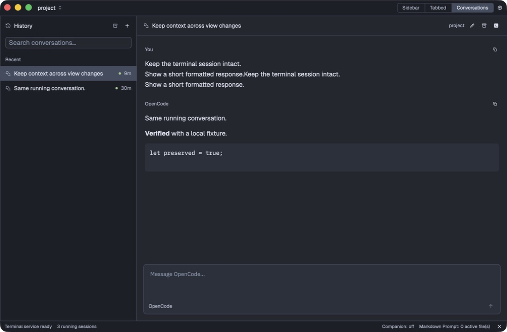
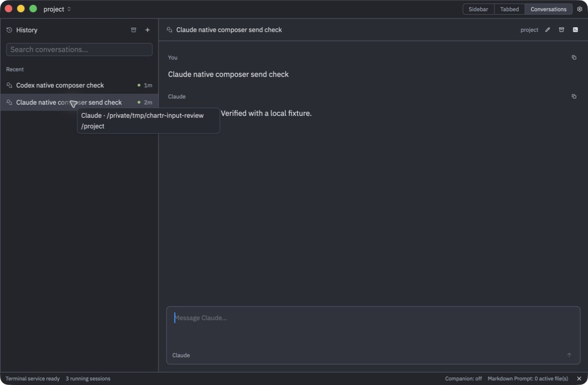
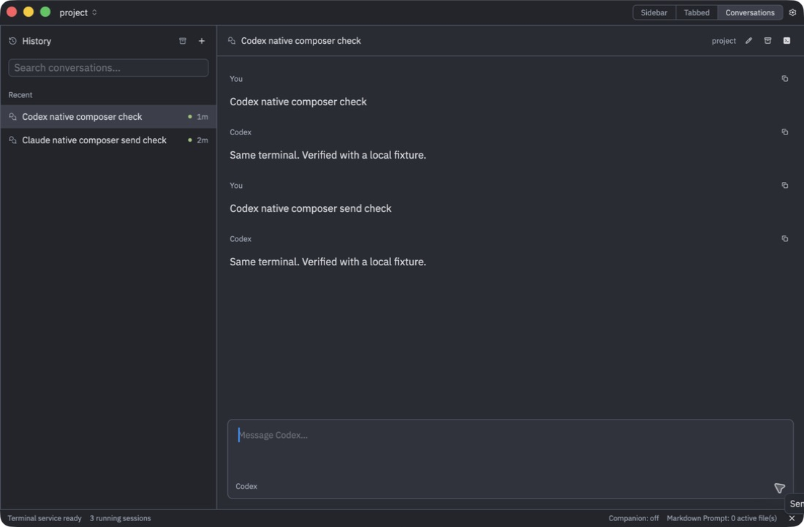
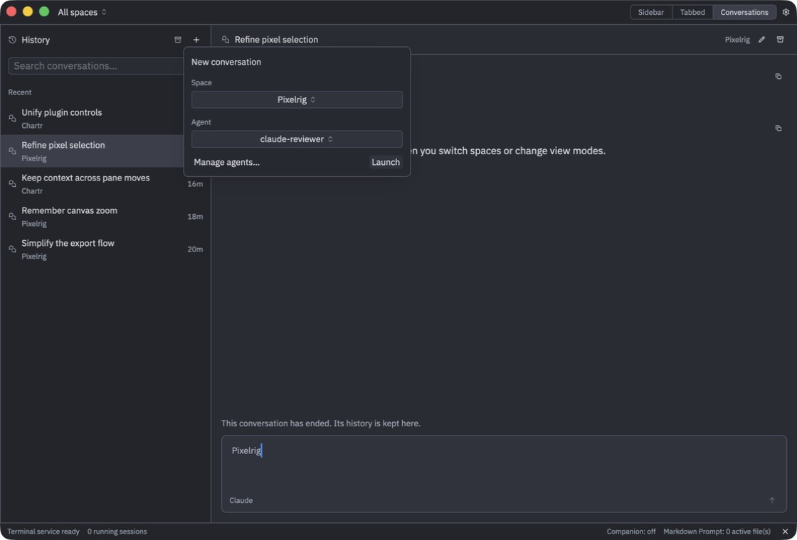
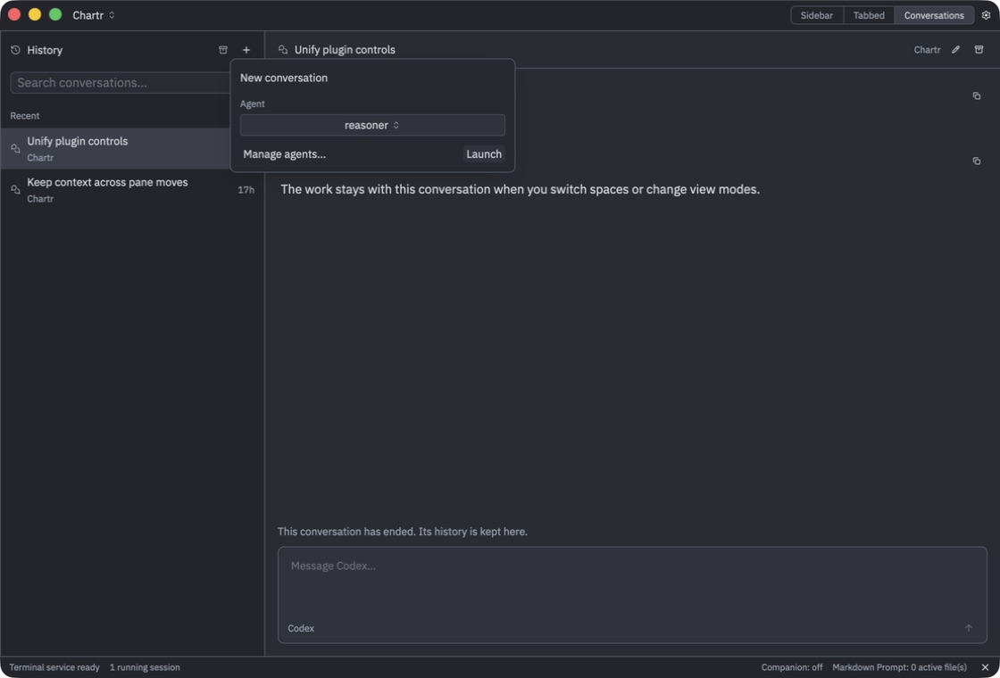

# Conversation mode: first native implementation

10 September 2026. Implements the approved first milestone from [the proposal](2026-09-10-rich-chat-mode.md), on the native Rust application. See [usage and compatibility](../conversations.md) and [the published Slopchan update](https://slopchan.john.shiksha/posts/83). The earlier proposal remains a historical record, not a claim of universal CLI interoperability.

The central decision is to keep Herdr as runtime owner. History is a separate projection over verified provider conversations; panes remain the projection over terminals and plugin items. This preserves arbitrary pane organization without requiring a group to have one semantic task name. The third view contains History and chat, while “Show in terminal” returns to the existing workspace item.

## Brief competitor source comparison

[Paseo’s agent manager](https://github.com/getpaseo/paseo/blob/da8c1b5c94e752b01d451645e5fa52aba2c1b2f0/packages/server/src/server/agent/agent-manager.ts) manages provider runtimes, their capabilities and durable timeline state. [T3’s Codex adapter](https://github.com/pingdotgg/t3code/blob/08463e2c401ce87858aaaebcb70ed86fb002fb5f/apps/server/src/provider/Layers/CodexAdapter.ts) owns its app-server session lifecycle. Their clean thread views benefit from control over how each agent starts. Copying that ownership model would change Chartr’s ordinary-terminal contract.

[Unpeel’s runtime observer](https://github.com/unpeel-com/unpeel/blob/a058275f1ff4433e73e477109a135276bacaf17f/crates/unpeel-core/src/runtime_observer.rs) is closer to our situation: runtime observation is distinct from a promise that the application can resume or control a provider. Chartr separates detected, readable and interactive capabilities accordingly.

The chosen interaction path is OpenCode’s original local server. [The installed version’s TUI launcher](https://github.com/anomalyco/opencode/blob/v1.2.27/packages/opencode/src/cli/cmd/tui/thread.ts) requires explicit networking options for an external listener; a default launch uses its internal worker transport. This version-specific source narrows the broader [server documentation](https://opencode.ai/docs/server/). Starting another `opencode serve` process would not prove switching views over the same running TUI.

## Implemented

- Third native mode, toolbar/palette/shortcut integration and restored terminal mode.
- Compact History/search/archived list; manual titles; selected conversation context; local drafts; retained history; formatted messages and tool disclosures.
- Herdr native conversation identity and foreground process metadata consumed by Chartr.
- Exact-ID Codex and Claude transcript readers, OpenCode database/API reader, and truthful Grok/unknown-identity fallbacks.
- Same-instance OpenCode text submission, interruption, simple choice questions, and allow-once/deny permission controls.
- New OpenCode conversation launches a normal Herdr-owned CLI and verifies identity before adoption.
- Private history database, transactional provisional-row promotion, versioned draft saves, persistent uncertain-delivery records, and stale-question rejection.
- Existing theme/component/font infrastructure; no hard-coded conversation color palette. Fixed the existing System UI font option’s native family mapping.

The native composition follows the owner’s approved History/chat image: single-line rows, one quiet header, prose/tool disclosures and a bottom composer. It uses Chartr’s existing themes. This is an implementation of that surface, not a declaration that every existing plugin now follows a completed design system.

## Findings from real execution

An API receipt is not identity acceptance: Herdr can receive a native session report before its process detector grants authority. New conversation creation now reads the binding back and waits for acceptance.

Foreground process order can change when an agent starts helpers. The input binding now prefers the actual OpenCode process over helper ordering and rechecks ownership of the loopback listener before control operations.

OpenCode message IDs have ordering semantics. An arbitrary `msg_chartr_…` identifier passed its API schema but kept the user message ordered after its replies, repeating the agent loop. The implementation now follows [OpenCode’s timestamp-prefixed identifier format](https://github.com/anomalyco/opencode/blob/v1.2.27/packages/opencode/src/id/id.ts), with a regression test. These loops occurred only against the isolated local model fixture.

A TUI event emitted before its listener starts can be lost even when the HTTP endpoint acknowledges it. New launches wait for the tested TUI readiness marker, select once, and verify its rendered conversation title before publishing the binding. Subsequent sends and view switches do not reselect the TUI, because reselection can reset its unsent input. Provider directories are canonicalized so symlinked paths do not create different event-bus instances. The live proof now checks that the actual TUI displays the exchange, rather than checking its database alone.

The first native pass also caught draft input arriving during an asynchronous send. The composer now clears at submission, leaves subsequent typing as a new draft, and restores failed input without automatically resending it.

## Verification and remaining limits

The workspace test suite passed: 308 tests, with opt-in integration/doctests excluded by default. The separate real OpenCode 1.2.27 test passed using two ordinary TUI processes, real Herdr identities, a local deterministic model responder, lazygit and a shell. It also verified preservation of an unsent terminal draft, real question answering, stale-answer rejection, and history/draft reopen. Native build, example-plugin compatibility, formatting and diff checks passed. The published report's text and attached image were fetched back and verified; see the [publication receipt](2026-09-10-conversation-mode-publication.json).

At the first milestone, live rich input was OpenCode-specific. Codex and Claude have readable transcript adapters with fixture coverage; Grok has detection and terminal fallback. Images, complex questionnaires, custom answers, automatic resume, remote hosts, per-terminal provider namespaces, comprehensive Markdown features and history export/delete remain additional work. Switching/discovery performs no inference. Deliberate chat sends use the ordinary CLI’s model configuration.

## Integration setup correction

[Published correction and verification](https://slopchan.john.shiksha/posts/84).

The owner's subsequent test exposed a gap in the first milestone's validation:
the actual Enable integration flow and upgrades from the earlier shell wrapper
were not covered by the clean OpenCode fixture.

Three issues were corrected. Successful installation previously cleared an error
without displaying confirmation, leaving the same Enable button visible. Setup
now reads back installed state, shows progress and inline failures, and explains
that a running process does not acquire newly installed hooks retroactively.
The connection card also keeps its button at its natural width and height.

The older generated `chartr-session-shell` restored the launching terminal's
Herdr socket and pane identity. Read-only inspection confirmed Codex, Claude and
OpenCode were reporting to the older Chartr Dev backend rather than the backend
that owned their actual terminals. A narrowly scoped migration removes those
stale routing overrides, preserves the user's shell/config environment, and
retains a backup. Existing processes keep their original environment; fresh
terminal tabs are required. The owner's local wrapper was repaired without
restarting or terminating their sessions.

Herdr's pinned OpenCode installer writes to `~/.config/opencode`, but the user's
custom XDG directory was what OpenCode actually loaded. Chartr now also places
the same managed server plugin in the terminal config directory and verifies its
contents before showing Enabled. Unmanaged plugins are not overwritten. This
addresses the known application/legacy-wrapper config directory; arbitrary
per-terminal config overrides remain outside the initial binding support.

Verification: 265 targeted Chartr/Herdr tests passed, including regressions for
legacy routing, idempotent migration, installer verification/errors, setup state
and plugin placement. Native build and formatting/diff checks passed. A native
UI fixture confirmed the real Enable button changes to the success instruction.
A temporary terminal on the owner's actual daemon verified the correct socket
and pane identity, then was removed. No agent prompts or paid model requests
were used for these checks.

## Codex and Claude sending correction

[Published correction and native UI proof](https://slopchan.john.shiksha/posts/87).

The owner's follow-up made the missing capability explicit: a read-only chat
surface is insufficient for the daily-use providers. Codex and Claude now accept
plain text from the native composer in the same running terminal session.
This supersedes their read-only capability statement in the original milestone.

The standalone Codex 0.154.0 TUI inspected here had no external control listener.
Its `queue` implementation goes through an app-server session command, so the
existence of that command does not prove it can control this already-running
standalone TUI. Starting another app-server or SDK agent would change runtime
ownership. The installed CLI and pinned source were inspected before choosing
Herdr's existing `pane.send_input` channel. Claude uses the same transport.

Before input, Chartr verifies the native conversation, pane, terminal, foreground
agent process, idle status and recognized empty prompt. It then sends one
bracketed paste plus Enter. It neither launches nor resumes a replacement agent.
A terminal draft, open menu or approval blocks the send and preserves the chat
draft. Slash commands and non-text interactions remain in the terminal.

Acceptance comes from a new matching human message in the provider's structured
transcript, not from successful writing of terminal bytes. The pending delivery
and prior user-message identities are persisted before input. Repeated text must
match a new message; an old identical prompt cannot confirm it. Transport results
and transcript observations may arrive in either order. Pending receipts keep
that reconciliation independent of the currently rendered row. Unconfirmed sends
are not retried automatically, and explicitly unlocking restores submitted text.
Herdr does not support an atomic identity-conditioned write, so another client
simultaneously changing the terminal remains a race the immediate rechecks cannot
completely eliminate.

Live tests exposed two process-observation omissions: only OpenCode had been
requesting the PID needed for input, and Claude's executable is version-named
(`2.1.267`) while its argv0 is `claude`. Helpers such as `caffeinate` and hook
processes can lead a foreground list. Discovery now obtains process identities
for all three interactive providers and recognizes the actual agent by executable
name or argv0. Regression coverage prevents helper ordering from changing it.

The owner's screenshot also exposed a Codex transcript error. Model-visible
`role=user` response items contain injected environment and AGENTS.md context.
The reader now prefers Codex's actual `user_message` events, excluding injected
context from visible messages and automatic titles while preserving literal XML
that a human really sent.

Validation: 278 targeted Chartr, conversation and Herdr tests passed. The real
Codex 0.154.0 / Claude Code 2.1.267 TUI test passed using isolated provider roots,
a private Herdr daemon and deterministic local model endpoints. It verified
multiline Unicode, exact native identity and unchanged PID, new transcript
receipts, replies in the original TUI, preservation of terminal drafts and
rejection of a stale conversation ID. The Claude fixture uses `--bare`, a fixed
CLI session ID and a test-pane identity report; production discovery continues to
use the existing integration. The separate OpenCode 1.2.27 live regression also
passed. No paid models or user sessions were used for message tests.

The rebuilt native application was then exercised through its real controls:
Enter submitted a Claude message, and the Send button submitted a Codex reply.
Both exchanges appeared in chat and the original terminal; their pending receipts
cleared and the composers became available again. Native build, formatting and
diff checks passed. Relaunch the rebuilt app to load this implementation; existing
Herdr sessions stay available according to the configured exit policy.

## Registered-agent launch correction

The History + control now reads the Agent plugin's existing registry when opened.
It lists saved profile names, including multiple/custom profiles of one provider,
and provides Manage agents to open the same settings. The empty History action
uses the same picker. Selecting a profile opens a new composer; its first message
starts the configured CLI in a fresh terminal in the current space, and the
observed conversation becomes the selection. There is no second agent registry.

A new optional typed ConversationAgents service sits alongside the unchanged
Agents service. The plugin owns profile resolution, shell quoting, saved arguments
and environment. The host owns terminal allocation and conversation observation.
Profiles are resolved again after asynchronous setup, so disabling Agent or
removing a profile cannot launch a stale cached configuration. Known integrations
are installed/verified before the CLI starts, avoiding missed SessionStart events.
Unsupported rich adapters can still launch their registered command and offer
Open terminal. Startup errors retain the opening editor rather than silently
rerunning the command. That pre-launch editor is currently in-memory only.

Native testing found two launch-specific problems. Claude's variadic --tools
option can consume a positional prompt appended after saved arguments; its
positional opening prompt now precedes the options. A newly allocated terminal
also inherits Zed's six-row bootstrap grid until it renders. A hidden Claude
terminal could answer the first prompt yet omit the footer required for safe
follow-up input. Conversation launches now initialize a 120×36 grid through the
normal terminal resize path, before sending launch input. The actual pane layout
takes over when that terminal is shown; existing terminals are not resized.

OpenCode retains the explicit create/select/verify/native-ID handshake from the
first milestone, but starts with the selected registered executable, arguments and
environment. Missing loopback listener options are added only to that invocation.
An initial experiment using --prompt alone produced a completed TUI turn without
a verified Herdr identity, so it was not retained. Saved --session/--continue
options must acquire their own native identity rather than being replaced by a
fresh API-created session. Opening model/agent options are sent explicitly;
subsequent messages inherit the latest native user message's model, agent and
variant. This follows the pinned [OpenCode prompt implementation](https://github.com/anomalyco/opencode/blob/v1.2.27/packages/opencode/src/session/prompt.ts), whose API otherwise selects the default agent on each call.

Validation: 288 targeted Chartr/SDK/conversation/Herdr tests passed. The native
picker and empty-state picker displayed the same registered profiles. Actual UI
launches of a custom-named Codex profile and Claude profile completed opening and
follow-up turns while remaining in Conversations. Codex's saved environment was
also verified on its process, and Claude used its real SessionStart integration.
The screenshot in assets/conversation-registered-agents-2026-09-10.jpg shows the
custom Codex profile's two-turn exchange. Models were local deterministic fixtures
in private Herdr/provider directories; the owner's live agents were not prompted.

The OpenCode real-CLI regression also passed after adding checks for startup
screen readiness and explicit registered model/agent selection retained across
subsequent turns. It still covers two independent sessions, unchanged processes,
preserved terminal drafts, questions, stale replies and persistence. Launch
readiness now reads Herdr's visible alternate screen; a selection-based scrollback
read can be unavailable during startup. A final native OpenCode click-through
could not be repeated because Computer Use returned cgWindowNotFound across the
review app and existing Chartr app. This limits final UI verification; it does not
invalidate the passing real-process OpenCode test. Build, formatting and diff
checks passed.

## All spaces and the shared launch panel

The owner's next request adds All spaces to the Conversations space picker and
replaces the profile menu with a compact form. Single-space History now actually
filters by its selected space; All spaces interleaves every space's conversations
in the existing recency order. Both scopes use the same rows, with a muted space
label beneath the title. Space names also participate in search. Archived history
keeps its existing separate filter. Returning to terminal modes retains their
active space; All spaces is a persisted conversation scope rather than a synthetic
terminal workspace.

History + and the empty-state action open the same 320px panel. Space and Agent
are stock, bounded dropdown subpickers; the Space control is disabled and fixed
in single-space mode. Launch opens a composer configured for the selected pair,
and the opening message starts the registered CLI. This retains the working
provider startup path: starting an empty Codex TUI in an isolated experiment did
not produce its verified native conversation ID. We did not change launch into
an unbound, apparently writable chat. The panel remembers the last valid choices
in memory; opening drafts are keyed by space and profile instead of profile alone.

The host carries the chosen stable space key through asynchronous integration
setup, rechecks that the destination still exists, and allocates there without
depending on the active terminal space. Agent registry resolution and input
transport remain the paths established above. Changing scope dismisses the
previous pending composer selection rather than selecting an out-of-scope result.

History now stores an optional SpaceIdentity separately from cwd, runtime and
native identity. Observations prefer the terminal's actual owning space. This
metadata survives provisional-row promotion, missing later observations, terminal
exit and database reopen. Current registry names take precedence for display;
removed spaces retain their recorded label in All spaces. Legacy rows without
ownership use the most specific matching registered folder, with path-component
boundaries. Duplicate space names include paths to distinguish them.

Validation: 254 targeted tests passed (242 Chartr, 12 conversation), including
space ownership across promotion/exit/reopen, nested and similarly prefixed folder
paths, explicit ownership over cwd, duplicate names, and persisted scope defaults
and round trip. Build, formatting and diff checks passed.

An isolated native review used two registered projects and interleaved fixture
history. Single-space History displayed only its two matching rows and disabled
the launcher's space field. A restored All spaces scope displayed both projects,
and both nested pickers selected their values without closing the parent panel.
A native launch selected Pixelrig and the registered claude-reviewer profile while
the terminal workspace remained Chartr. The real Claude TUI answered through a
local deterministic model fixture; its Herdr cwd and persisted SpaceIdentity were
Pixelrig, while the saved active terminal space remained Chartr and scope remained
All spaces. The owner's agents and provider credentials were not used.

Computer Use captures sometimes retained stale frames until window resize, and
the separate native space menu could not be reliably driven by that tool. Scope
rendering was therefore checked with persisted fixture states; the All spaces
menu item was inspected, but its full click-through was not verified. The launch
panel's subpicker selection and cross-space launch were exercised in the UI.

### 11 September: omit redundant space selection

The owner refined the single-space launcher: hide both the Space label and its
picker instead of showing a disabled field. The panel now contains only Agent
and its actions in that scope, with Agent first in the picker tab order. The
destination still comes from the current space; All spaces keeps both fields.

Build, formatting and diff checks passed. Native visual/accessibility inspection
confirmed that the shorter single-space panel exposes only Agent and its actions.

